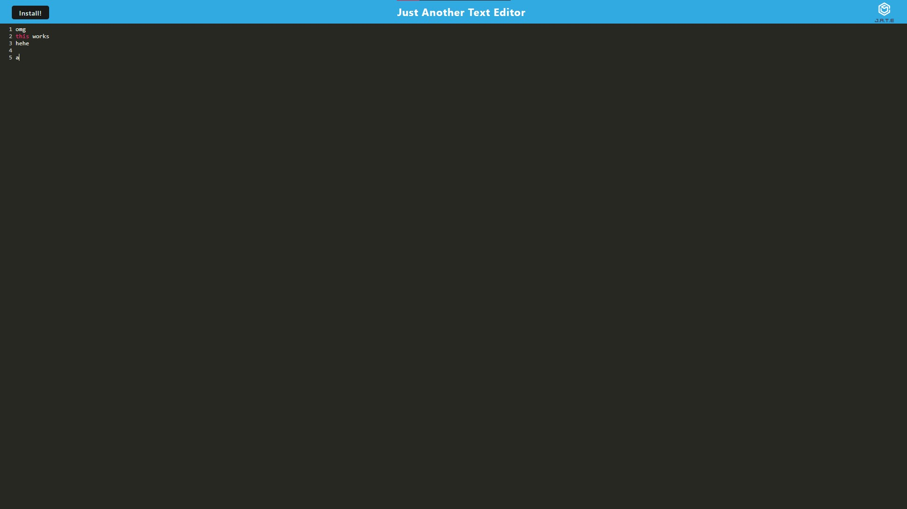

# PWA Text Editor

## Description

Users can type in any text in this text editor. As long as the web page cache is not cleared, all text is automatically saved and remains after closing the page.

This app is largely comprised of webpacks, service workers, and caching.

## Installation

If Node.js is not already installed in your system, you can get it at <https://nodejs.org>. Once installed, download the files in the repository. The files can then be accessed/opened in a command line window (either Command Prompt, Terminal, or Git Bash depending on what your system & what you have installed).

Within the command line, type "npm i" to install the app's dependencies.

## Usage

Open the website (<>), then type in any text.

Also, the user can press the "Install" button to install the webpage locally.

## Credits

Bulk of code provided by the University of Minnesota - Twin Cities.

## License

MIT License

Copyright (c) [2023] [Andrew Joo]

Permission is hereby granted, free of charge, to any person obtaining a copy
of this software and associated documentation files (the "Software"), to deal
in the Software without restriction, including without limitation the rights
to use, copy, modify, merge, publish, distribute, sublicense, and/or sell
copies of the Software, and to permit persons to whom the Software is
furnished to do so, subject to the following conditions:

The above copyright notice and this permission notice shall be included in all
copies or substantial portions of the Software.

THE SOFTWARE IS PROVIDED "AS IS", WITHOUT WARRANTY OF ANY KIND, EXPRESS OR
IMPLIED, INCLUDING BUT NOT LIMITED TO THE WARRANTIES OF MERCHANTABILITY,
FITNESS FOR A PARTICULAR PURPOSE AND NONINFRINGEMENT. IN NO EVENT SHALL THE
AUTHORS OR COPYRIGHT HOLDERS BE LIABLE FOR ANY CLAIM, DAMAGES OR OTHER
LIABILITY, WHETHER IN AN ACTION OF CONTRACT, TORT OR OTHERWISE, ARISING FROM,
OUT OF OR IN CONNECTION WITH THE SOFTWARE OR THE USE OR OTHER DEALINGS IN THE
SOFTWARE.
